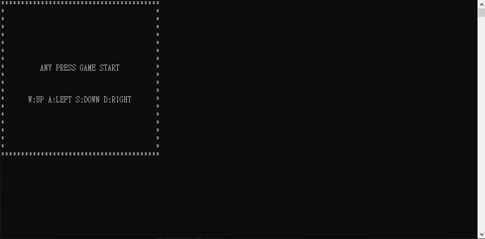
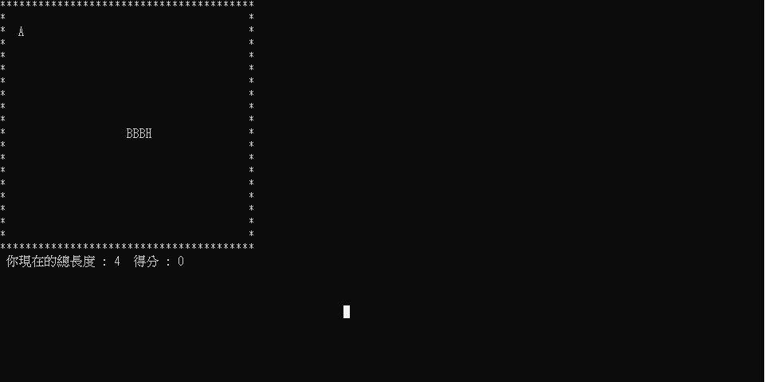
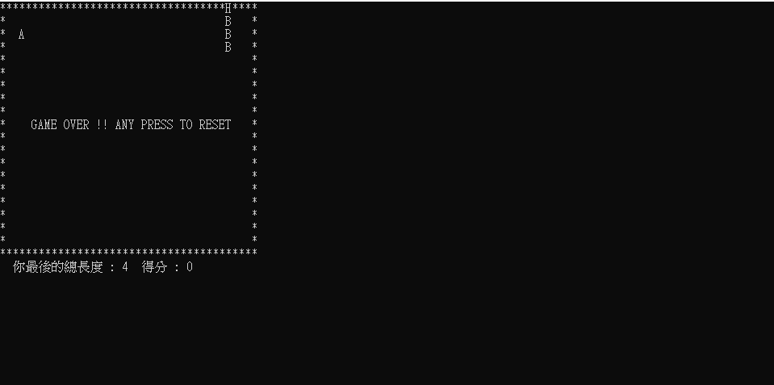

這是我的第一個 C語言 作品
=====
執行檔案在
[貪吃蛇執行檔案位置](./Release/)
執行檔名稱為 "EatEatSnake.exe"

單純簡單一個用CMD畫面呈現的貪吃蛇小遊戲
 
操作:  
WASD 控制上下左右

介紹:  
文字 * 為牆壁
文字 H 為蛇蛇頭部
文字 B 為蛇蛇身體
文字 A 為得分蘋果
遊戲速度會隨著吃到蘋果越多速度越快

起始畫面

遊戲中

遊戲結束

